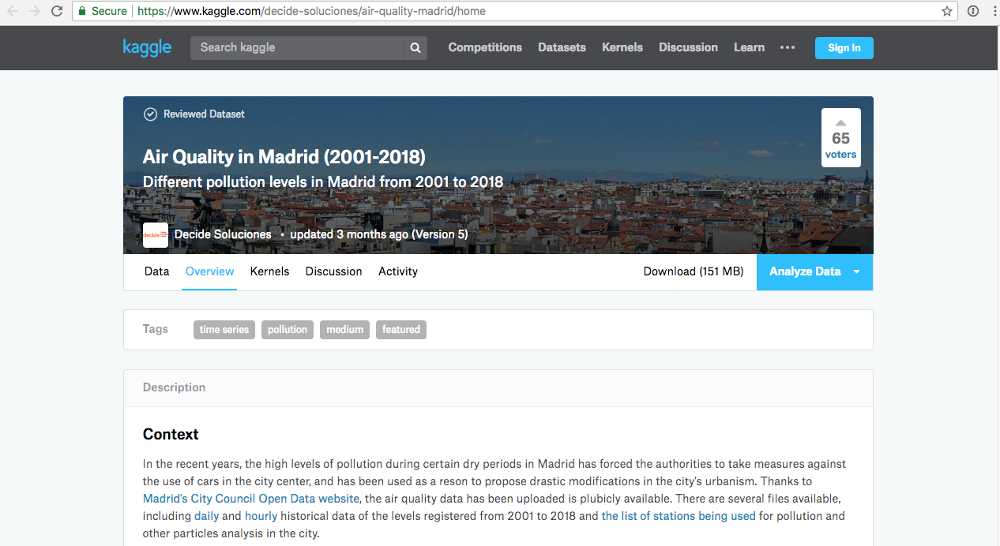
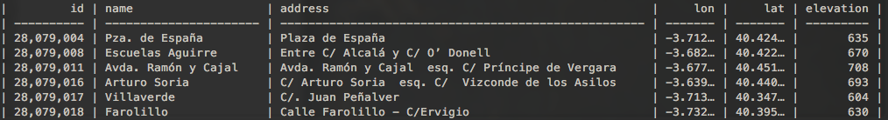
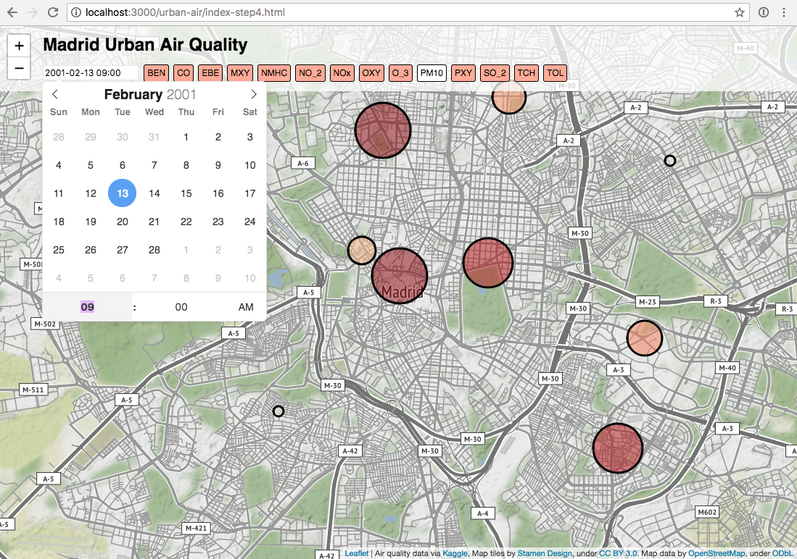

author: Stamen Design
summary: Make a map with Leaflet and the XYZ API
id: 2
categories: map
environments: js
status: draft
feedback link: https://github.com/here-xyz-codelabs/here-xyz-codelabs.github.io/issues
analytics account: 0

# Make a map with Leaflet and the XYZ API

## Introduction

This tutorial shows you how to create a Leaflet map using data from XYZ Spaces.

### What you'll learn
* The basics of using tags in XYZ Spaces
* How to upload a GeoJSON file to XYZ via the command line tool
* How to view your data in Leaflet
* How to interactively filter your data using XYZ tags

### Prerequisites
* Basic familiarity with the command line
* Basic familiarity with JavaScript

In this demo we'll download some air quality readings for the city of Madrid and plot the data on an interactive map.


## Getting the data

In this demo we’ll load up a large dataset into the xyz platform and query small slices of that data for rendering on a map. We’ll use the Madrid Air Quality dataset, graciously organized by kaggle here:

[https://www.kaggle.com/decide-soluciones/air-quality-madrid/home](https://www.kaggle.com/decide-soluciones/air-quality-madrid/home)



This dataset provides sensor measurements of various types of pollution in Madrid, Spain at an hourly resolution from 2001 - 2018. For the purpose of this demo we’ll just use one year’s worth of data.

Positive
: Note: You will have to create a free account on Kaggle to download the data.

Click the `Download` button to get the zip file containing the data.

## Preprocessing the data

After unzipping the dataset, you’ll see a `stations.csv` that looks like:



in the `csvs_per_year` folder, there is one file per year. we’ll use just 2001 `madrid_2001.csv`


Data in an xyz space should always have geometry information. In this case, we want every station’s hourly pollution measurement to be a datapoint. Since the station is referenced by id in `madrid_2001.csv`, we will have to join this file with `stations.csv` to get that coordinates of the  measurement in the same row.

We could write a script to do this operation, but since this is a common task, we’ll use an off the shelf tool called [csvkit](https://csvkit.readthedocs.io/en/1.0.3/) to do this operation. csvkit is a collection of command line tools to process csvs. It can do things like cut up, merge and view csvs. For example, to generate the views of the csvs above, we can use the `csvlook` command provided in csvkit.

```
    head madrid_2001.csv | csvlook
```

To merge the sensor data and the station data, we’ll use the csvjoin command:

```
    csvjoin -c "station,id" --left csvs_per_year/madrid_2001.csv stations.csv > out.csv
```

After the merge, you should see the merged table in `out.csv`


## Upload data to XYZ using the command line

One of the most powerful features of XYZ is the ability to use tags to select features. Currently the Studio upload interface doesn’t let us add tags, so we will use another approach here.

Specifically, we need to download and install the command line tool.

Negative
: Note: during the XYZ beta, you will need to ask someone within HERE to help you get the command line tool installed. Also, the exact steps for installing the command line tool will depend on your operating system, whether you're using Windows, OSX, or Linux. 

Once you have the command line tool installed, you’ll need to run `here configure` to set up your credentials. Specifically, you’ll need your **AppID** and **AppCode**.

Now try `here xyz list` to see any spaces you have set up already. You might not have any. Or if you do, you can try `here xyz describe [SpaceID]` to get some details about one of them.

Now we’re going to upload the air quality data using the command-line to add the appropriate tags. Before we upload any data, we need to create an empty XYZ space. Here’s how we do that, adding a name and description:

`here xyz create --title "urban-air" --message "urban air quality data uploaded from the command line"`

You’ll see the response:
`xyzspace '[SpaceID]' created successfully`

Instead of "[SpaceID]", you'll see an eight-character string of numbers and letters. This is your SpaceID.

Take note of that ID. We’ll need to use that for pretty much everything else we do. Now we can upload some data. There are a few different flags you can include when uploading data, but the one we’re most interested in right now is `-p` (or `--ptag` does the same thing). The `-p` flag lets us specify some properties in our GeoJSON file that we’d like to convert into XYZ tags. Since we want to be able query the data based on the time, we will tag every datapoint with it’s hourly timestamp. The here CLI tool makes this easy with the property tag command:

```
here xyz upload -f out.csv --lat lat --lon lon --ptag date [spaceID]
```

The `-p` or `--ptag` will create tags from the GeoJSON properties.

To verify that the data has been populated, we can preview it with the show command

```
    here xyz show -w [spaceID]
```


In the data editor, you should see that the properties object of each feature, there is a section for tags:

```

        "@ns:com:here:xyz": {
          "tags": [
            "2001-08-01t01:00:00",
            "date@2001-08-01t01:00:00"
          ],
          "space": "sZZXbJam",
          "createdAt": 1531683282547,
          "updatedAt": 1531683282547
        }
```

In this case the timestamp of the measurement has been turned into a tag.

## Reading slices of data

The xyz api provides the ability filter a dataset by tag. To try this out, use the geojson viewing tool and change the data provider url

from

```
    http://geojson.tools/index.html?url=https://xyz.api.here.com/hub/spaces/[SpaceID]/search?limit=5000&access_token=[AccessToken]
```

to

```
    http://geojson.tools/index.html?url=https://xyz.api.here.com/hub/spaces/[SpaceID]/search?tags=2001-08-01t01:00:00&%27limit=5000&access_token=[AccessToken]
```

You should see that the previewer re-renders with only data that matches `data ==` `'``2001-08-01t01:00:00``'`

Try changing the date to get different data.

## View the data in a Leaflet map

Next, we will view some of this data in Leaflet. Leaflet is a simple mapping library that can draw simple points, lines, and polygons on top of a raster basemap.

Here is a [basic Leaflet template](https://github.com/stamen/here-xyz-demo/blob/master/urban-air-leaflet/index-step1.html) which gives us a raster “slippy” map, with nothing on it. To view this code in your browser, you can quickly run a webserver using `python -m SimpleHTTPServer`. Or you could upload it to your own personal webpage, or use something like blockbuilder.org to view this simple page. 

Positive
: Note: This code snippet includes a bunch of CSS that we will use later. We won't explain most of it in this tutorial. If you're curious about CSS, there are tons of resources online to learn more.

```
<!doctype html>
<html lang="en-us">
  <head>
    <meta charset="utf-8">
    <meta http-equiv="Content-Type" content="text/html; charset=utf-8">
    <meta name="viewport" content="width=device-width, initial-scale=1.0, maximum-scale=1.0, user-scalable=no">
    <title>Madrid Urban Air Quality</title>
    <link rel="stylesheet" href="https://unpkg.com/leaflet@1.3.3/dist/leaflet.css" />
    <link rel="stylesheet" href="https://cdn.jsdelivr.net/npm/flatpickr/dist/flatpickr.min.css">
    <script src="https://cdn.jsdelivr.net/npm/flatpickr"></script>

    <style>
        body {
            font-family: sans-serif;
            margin: 0px;
            border: 0px;
            padding: 0px;
        }
        .container {
            top: 0;
            left: 0;
            right: 0;
            bottom: 0;
            position: absolute;
        }
        .header {
            position: absolute;
            top: -8px;
            left: 0px;
            padding-left: 50px;
            right: 0;
            padding: 10px;
            z-index: 1000;
            background-color: rgba(255,255,255,0.75);
        }
        h2 {
            margin: 10px 0;
            margin-left: 50px;
        }
        h3 {
            margin: 0;
        }
        #map {
            height: 100%;
            width: 100%;
        }

        #property-list, #playback {
            display: inline-block;
        }

        .view {
            display: inline-block;
            font-size: 12px;
            border: 1px solid black;
            border-radius: 3px;
            margin: 3px;
            padding: 4px;
            background: #ffab96;
        }

        .view:hover {
            background: dodgerblue;
            color: white;
            margin-top: -2px;
            box-shadow: 1px 1px 1px black;
        }

        .view:active {
            margin-top: -2px;
        }

        #playback {
            margin-right: 1em;
            margin-left: 1em;
        }

        #playback .view {
            background-color: #ab96ff;
        }

        .view.selected {
            background: white;
            color: black;
        }

        #datepicker {
            margin-left: 50px;
            font-size: 12px;
        }

        .flatpickr-minute {
            pointer-events: none;
        }

        .flatpickr-minute + .arrowUp {
            pointer-events: none;
        }

        .flatpickr-minute + .arrowUp + .arrowDown {
            pointer-events: none;
        }

        .numInputWrapper:nth-child(3):hover {
            background: none;
        }

        .numInputWrapper:nth-child(3):hover .arrowUp {
            display: none;
        }

        .numInputWrapper:nth-child(3):hover .arrowDown {
            display: none;
        }


    </style>
  </head>

  <body>
    <div class="header">
        <h2>Madrid Urban Air Quality</h2>
    </div>
    <div class="container">
        <div id="map"></div>
    </div>

    <!-- leaflet -->
    <script src="https://unpkg.com/leaflet@1.3.3/dist/leaflet.js"></script>

    <!-- D3 -->
    <script src="https://d3js.org/d3.v5.min.js"></script>

    <!-- Demo setup -->
    <script>
        var theMap = L.map('map', {maxZoom: 14});
        theMap.attributionControl.addAttribution('Map tiles by <a href="http://stamen.com">Stamen Design</a>, under <a href="http://creativecommons.org/licenses/by/3.0">CC BY 3.0</a>. Map data by <a href="http://openstreetmap.org">OpenStreetMap</a>, under <a href="http://www.openstreetmap.org/copyright">ODbL</a>');

        L.tileLayer('http://tile.stamen.com/terrain/{z}/{x}/{y}.png').addTo(theMap);
        // center of madrid
        theMap.setView([40.416232, -3.703637], 13);

    </script>

  </body>
</html>
```

Admire your slippy map! It should look like [this](https://stamen.github.io/here-xyz-demo/urban-air-leaflet/index-step1.html):


Now it’s time to get some data on it!

## Load the data onto your map


We will load a GeoJSON layer from our XYZ space like so: `https://xyz.api.here.com/hub/spaces/[SpaceID]/search?access_token=[AccessToken]&tags=2001-08-01t01:00:00`

Note that we have to include a date tag filter, or else we will see hundreds of points stacked on top of each other at each air quality station.

So let's extend our code to load that data and to draw some circles on our map. 

First, add this code at the very beginning of our script, before the line `var theMap = L.map('map', {maxZoom: 14});`:

```
        var circles = [];
        var initDate = '2001-02-23t09:00:00';
        var timeFormatter = d3.timeFormat('%Y-%m-%dt%H:%M:%S');
        var numberFormatter = d3.format(".1f");

        var properties = [
            { code: 'BEN', desc: 'benzene level measured in μg/m³' },
            { code: 'CO', desc: 'carbon monoxide level measured in mg/m³' },
            { code: 'EBE', desc: 'ethylbenzene level measured in μg/m³' },
            { code: 'MXY', desc: 'm-xylene level measured in μg/m³' },
            { code: 'NMHC', desc: 'non-methane hydrocarbons level measured in mg/m³' },
            { code: 'NO_2', desc: 'nitrogen dioxide level measured in μg/m³' },
            { code: 'NOx', desc: 'nitrous oxides level measured in μg/m³' },
            { code: 'OXY', desc: 'o-xylene level measured in μg/m³' },
            { code: 'O_3', desc: 'ozone level measured in μg/m³' },
            { code: 'PM10', desc: 'particles smaller than 10 μm' },
            { code: 'PXY', desc: 'p-xylene level measured in μg/m³' },
            { code: 'SO_2', desc: 'sulphur dioxide level measured in μg/m³' },
            { code: 'TCH', desc: 'total hydrocarbons level measured in mg/m³' },
            { code: 'TOL', desc: 'toluene (methylbenzene) level measured in μg/m³' }
        ];
        var currProperty = 'PM10';
```

All of that is just to help us parse the dates and to display descriptions for the various air quality indicators.

Next, add this code add the end of our script, basically all after the line `theMap.setView([40.416232, -3.703637], 13);`

```
        var radiusScale = d3.scaleLinear().domain([0, 200]).range([7, 70]).clamp(true);
        var colorScale = d3.scaleSequential(d3.interpolateOrRd).domain([0, 100]);
        function renderCircles() {
            // remove old markers
            circles.forEach(function (c) { c.remove(); })
            circles = [];

            theData.features.forEach(function (feature) {
                var c = L.circleMarker(
                    [feature.geometry.coordinates[1], feature.geometry.coordinates[0]],
                    {
                        radius: radiusScale(feature.properties[currProperty]),
                        // color: colorScale(feature.properties[currProperty]),
                        color: 'black',
                        fillColor: colorScale(feature.properties[currProperty]),
                        fillOpacity: 0.5
                    });
                c.addTo(theMap);
                c.bindTooltip('<h3>' + feature.properties.name + '</h3>' + '<b>' + currProperty + ': </b>' + numberFormatter(feature.properties[currProperty]) + '<br>' + properties.filter(d => d.code === currProperty)[0].desc);
                circles.push(c);
            });
        }

        function fetchData(dateStr) {
            var url = 'https://xyz.api.here.com/hub/spaces/[SpaceID]/search?limit=100&access_token=[AccessToken]&tags=' + dateStr;
            d3.json(url).then(function(data) {
                theData = data;
                renderCircles();
            });
        }

        fetchData(initDate);
```

In this block of code, we're actually using [d3.js](https://d3js.org/) to calculate appropriate circle sizes, but we're still using Leaflet to draw the circles on the map.

Note that we also add a tooltip to the circles, so you can see the raw data when you hover over a circle on the map.

At the end of this block of code, you can see the fetchData() function which is where we query the XYZ API to get the data.

Positive
: Remember to add your own **SpaceID** and **AccessToken** to the code snippet above!

Now your map should look something like [this](https://stamen.github.io/here-xyz-demo/urban-air-leaflet/index-step2.html):


Next we will add some interactivity...

## Add some controls to select different air quality indicators

Each record returned by our XYZ query includes several different air quality measurements. Let's add some simple selection buttons so our user can view the different values in our data.

First add a new HTML element after the line `<h2>Madrid Urban Air Quality</h2>`

```
       <div id="property-list"></div>
```

This div is where our buttons will go.

Now, after we define our `properties` object (specifically, after the line `var currProperty = 'PM10';`) we will add a new function that will draw selection buttons for each air quality metric. When clicked, each button will re-render the circles using the new selected metric.

```
        function renderProperties() {
            var pp = d3.select('#property-list').selectAll('.view').data(properties);
            pp.enter()
                .append('div')
                .classed('view', true)
                .on('click', d => {
                    currProperty = d.code;
                    renderProperties();
                    renderCircles();
                })
                .attr('title', d => d.desc)
                .text(d => d.code)
                .merge(pp)
                .classed('selected', d => d.code === currProperty);
        }
```

Finally, at the end of our script, we call this function once to draw the buttons:

```
        renderProperties();

```

Now your map should look something like [this](https://stamen.github.io/here-xyz-demo/urban-air-leaflet/index-step3.html):


Try clicking on the different buttons to see the circles change size!


## Add controls to illustrate querying XYZ by tag

This interactivity is pretty cool, but we're only viewing different aspects of the data that we've already downloaded. Now let's let the user select data for a different date, which will trigger a new XYZ query and use our XYZ tags to download the correct data.

We're going to use the [flatpickr](https://flatpickr.js.org/) library, which we already included in the header of our html page. Now, after the line `<h2>Madrid Urban Air Quality</h2>`, let's add an input for our date picker control:

```
<input id="datepicker" class="flatpickr flatpickr-input" type="text" placeholder="Select Date..." readonly="readonly">
```

And then in our script, we need to call the `flatpickr` function to create the control itself:

```
        var calendar = flatpickr("#datepicker", {
            enableTime: true,
            dateFormat: "Y-m-d H:i",
            minDate: "2001-01-01",
            maxDate: "2001-12-31",
            minuteIncrement: 60,
            onChange: function(selectedDates, dateStr, instance) {
                fetchData(timeFormatter(selectedDates[0]))
            }
        });
```

Notice how the date picker will call the `fetchData()` function anytime the user changes the currently-selected date. If you recall, `fetchData()` makes a query to XYZ using the requested date tag, and then re-renders the circles with the new data.

Finally, we need need to add one more line to populate our date picker with the initial date: 

```
        calendar.setDate(initDate);
```

Your map should now look like this:



Click on the date to open up the calendar interface, and try choosing different dates or times to see the map update!


## Add a play button

The date picker is pretty powerful, because it lets us select any date we choose. However, it's a bit inconvenient if we simply want to watch how the data changes over time. For our final enhancement, let's add a play button.

After the datepicker `<input>` element, add these lines:

```
        <div id="playback">
            <div id="back" class="view" onclick="addHours(-1)">&lt;</div>
            <div id="play" class="view" onclick="play()">Play</div>
            <div id="next" class="view" onclick="addHours(1)">&gt;</div>
        </div>
```

These buttons will make it easy to move forward or backward one hour at a time. Now in our `<script>` tag, add the appropriate functions and variables:

```
        function addHours(n) {
            var selectedDate = calendar.selectedDates[0];
            selectedDate.setHours(selectedDate.getHours() + n);
            calendar.setDate(selectedDate, true);
        }

        var playTimer;

        function play() {
            if (playTimer) {
                window.clearInterval(playTimer);
                playTimer = 0;
                document.getElementById("play").innerHTML = "Play";
            } else {
                playTimer = window.setInterval(function() { addHours(1) }, 1000);
                document.getElementById("play").innerHTML = "Pause";
            }
        }
```

Now if we reload our map, we should see [this](https://stamen.github.io/here-xyz-demo/urban-air-leaflet/index.html):


Try out the "play" button, or the forward/backward arrows. Each time the map switches to a new date, it is making a new query to XYZ, using on the tags that you created when you uploaded the data. Pretty cool, right?


