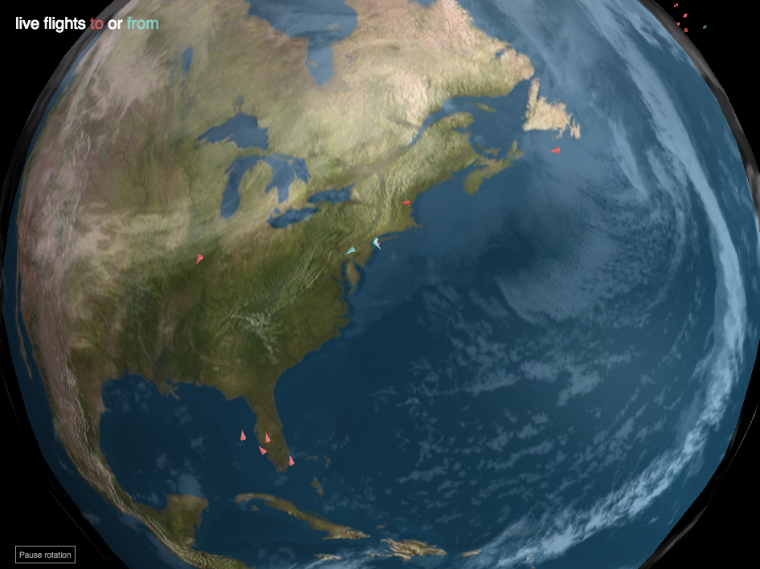

author: Stamen Design
summary: Make a live-updating map with three.js and the XYZ API
id: 4
categories: map
environments: js
status: draft
feedback link: https://github.com/here-xyz-codelabs/here-xyz-codelabs.github.io/issues
analytics account: 0

# Make a live-updating map with three.js and the XYZ API

## Introduction

This tutorial shows you how to create a 3D map using live-updating data from XYZ Spaces. 

### What you'll learn
* How to write a script to update and delete data in XYZ via the API.
* How to display points on a 3D globe using three.js

### Prerequisites
* Basic familiarity with the command line
* Basic familiarity with JavaScript

In this demo we'll use live updated flight tracker data to draw the real-time positions of aircraft on a 3D globe.



## Create a script to refresh to data in XYZ

Let’s try out more of the features of the XYZ API, such as adding and deleting features. Here we're going to write a simple [node.js](https://nodejs.org/) script that queries the flights API every minute, and uploads the new points to our XYZ space.

Create a file called `upload.js` with your favorite text editor. Now we'll add a few lines to load some necessary libraries:

```
var async = require('async')
var request = require('request')
var fs = require('fs')
var _ = require('underscore')
```

Then add a config object with your space ID:

```
/* ===========================================================================*/
var config = {
  spaceId: 'SpaceID',
  token: 'AccessToken'
}
/* ===========================================================================*/
```

Now write a query function that will request data for the airports of interest:

```
// Only query for the airports of interest, to avoid swamping the server
function queryData() {
  var airports = [
    'KSFO',
    'KJFK',
    'SBGR',
    'EGLL',
    'FAOR',
    'OMDB',
    'ZBAA',
    'RJTT',
    'RJAA',
    'YSSY'
  ];

  airports.forEach(function(airport) {
    queryAirport(airport);
  });
}
```

Now we'll write the a function that will be called for each airport. Because the ADSB Exchange API returns a JSON object that isn't in GeoJSON format, we need to rewrite the results as proper GeoJSON:

```
function queryAirport(airport) {
  console.log('fetching data for ' + airport + '...');
  var geojson = {
    "type": "FeatureCollection",
    "features": []
  }
  request('https://public-api.adsbexchange.com/VirtualRadar/AircraftList.json?fAirQ=' + airport,
  function (error, response, body) {

    var json = JSON.parse(response.body)
    _.each(json.acList, function(row, index) {
      if (row.Lat & row.Long) {
        // check for invalid points
        if (row.Lat > -90 && row.Lat < 90
          && row.Long > -180 && row.Long < 180) {
        geojson.features.push({
          type: "Feature",
          //id: row.Id.toString(),
          properties: row,
          geometry: {
            type: "Point",
            coordinates: [row.Long, row.Lat]
          }
        })
       }
     }
    })
    console.log(airport + " got " + geojson.features.length + " features")
    addDataToSpace(geojson)
  })
}
```

Then we need a function that will push this new GeoJSON object into our XYZ space. Note that we create a bunch of tags that we might want to use later, and include them in the object when we send it to the XYZ API.

Since we plan to constantly update this XYZ space, we now will have multiple locations for each plane which is why we need to add more tags to specify the date for each point.

```
function addDataToSpace(geojson) {

  async.eachLimit(geojson.features, 10, feature => {

    // here we'll upload each record with its own sets of tags.
    // Tags:
    //   To airport
    //   From airport
    //   date, time (maybe separate these out)
    //   aircraft registration ID

    var posTime = new Date(feature.properties.PosTime);

    var tags = [
      "from-" + (feature.properties.From ? feature.properties.From.substring(0,4) : ""),
      "to-" + (feature.properties.To ? feature.properties.To.substring(0,4) : ""),
      "reg-" + (feature.properties.Reg ? feature.properties.Reg : ""),
      "month-" + (posTime.getMonth() + 1),
      "day-" + posTime.getDate(),
      "hour-" + posTime.getHours(),
    ]
    //console.log('adding to space with tags: ' + tags)

    feature.properties["@ns:com:here:xyz"] = {
      "tags": tags
    }

    var options = {
      method: 'PUT',
      url: 'https://xyz.api.here.com/hub/spaces/' + config.spaceId + '/features', // instead of adding the tags here, I'll write them into the geojson object above
      headers:
       {
         'Authorization': 'Bearer ' + config.token,
         'Content-Type': 'application/geo+json'
       },
      body: JSON.stringify(feature)
    }
    request(options, function(error, response, body) {
      if (error) {
        console.log(error)
      }
    })
  }, function() {
    console.log('done ' + geojson.features.length + ' features!')
  });
}
```

And then finally at the end of our script, we'll call the `queryData()` function once when the script loads, and then start a timer that will call it again every minute, as long as the script keeps running.

```
queryData();

setInterval(function() {
  queryData()
}, 60000) // 60 seconds, aka 1 minute(s)
```


We also don’t want our database to fill up over time, so we also need to add an API request that deletes old locations.

## View the points in three.js

If we want to see the points on a 3D map, we can’t use Leaflet or Tangram. So let’s try another frontend library, called three.js.

Here is a premade spinny globe in three.js.


The details of three.js are not the focus of this tutorial, so to get you started, here is enough code to get up and running with a nice 3D globe. You don't need to pay much attention to the details if you don't want to.

Open up a file called `index.html` in your favorite text editor, and copy in the following code. First, the HTML headers:

```
<!DOCTYPE html>
<html>
    <head>
        <meta charset=utf-8>
        <meta name="viewport" content="width=device-width, initial-scale=1, maximum-scale=1.0, user-scalable=no">
        <title>Live Flights</title>
        <style>
            body { margin: 0; }
            canvas { width: 100%; height: 100% }
        </style>
    </head>
```

Then, the CSS styles we will need for various parts of this map.

```
<style>
body {
    font-family: sans-serif;
    margin: 0px;
    border: 0px;
    padding: 0px;
    color: white;
}
#control {
    position: absolute;
    left: 0;
    top: 0;
    padding: 20px;
}
h2 {
    margin-top: 0;
    margin-bottom: 10px;
    font-size: 20px;
    font-weight: normal;
}
.to {
    color: #FF6464b8
}
.from {
    color: #8AECE4b8;
}
#property-list {
    margin-left: -3px;
}
.view {
    display: inline-block;
    font-size: 10px;
    height: 12px;
    line-height: 10px;
    border: 1px solid #979797;
    color: #979797;
    margin: 3px;
    padding: 4px;
    cursor: pointer;
    background: none;
}
.view.selected {
    border: 1px solid white;
    color: white;
}
#pauseButtonId {
    position: absolute;
    border: 1px solid #979797;
    color: #979797;
    font-size: 10px;
    height: 12px;
    left: 0;
    bottom: 0;
    margin-left: 20px;
    margin-bottom: 10px;
    padding: 4px;
}
#tooltip {
    position: absolute;
    display: none;
    font-size: 10px;
    background: rgba(0,0,0,0.4);
    padding: 4px;
}
</style>
```

And finally, we add the body, which contains the inline javascript to make the globe in three.js:

```
   <body style='margin: 0px; background-color: #000000; overflow: hidden;'>
    <div id="control">
        <h2>live flights <span class="to">to</span> or <span class="from">from</span></h2>
        <div id="property-list"></div>
    </div>
    <div id="pauseButtonId">Pause rotation</div>
    <div id="tooltip"></div>


        <script src="https://cdnjs.cloudflare.com/ajax/libs/fetch-jsonp/1.1.3/fetch-jsonp.min.js"></script>
        <script src="https://d3js.org/d3.v5.min.js"></script>
        <script src="./js/three.min.js"></script>
        <script src="./js/CustomOrbitControls.js"></script>
        <script src="./js/threex.domevents.js"></script>

        <script>

            var runAnim = true;
            var scene = new THREE.Scene();
            var camera = new THREE.PerspectiveCamera( 75, window.innerWidth/window.innerHeight, 0.1, 1000 );
            var RADIUS = 1;
            var MAXHEIGHT = 0.04;

            var pauseButton = document.getElementById('pauseButtonId');

            pauseButton.onclick = function ToggleAnimation() {
              if (runAnim) {
                pauseButton.innerHTML = 'Restart rotation';
                runAnim = false;
              } else {
                pauseButton.innerHTML = 'Pause rotation';
                runAnim = true;
              }
            }

            var renderer = new THREE.WebGLRenderer();
            renderer.setSize( window.innerWidth, window.innerHeight );
            renderer.sortObjects = false;
            document.body.appendChild( renderer.domElement );

            var domEvents = new THREEx.DomEvents(camera, renderer.domElement);

            addLights();
            var world = new THREE.Object3D();
            addEarth(world);
            addClouds(world);
            scene.add(world);

            camera.position.z = 2;

            var rotSpeed = -0.0001;
            var controls = new OrbitControls( camera );
            controls.maxDistance = 10;
            controls.minDistance = 1.2;

            var animate = function () {
                requestAnimationFrame( animate );

                if (runAnim) {
                  var x = camera.position.x;
                  var z = camera.position.z;
                  camera.position.x = x * Math.cos(rotSpeed) + z * Math.sin(rotSpeed);
                  camera.position.z = z * Math.cos(rotSpeed) - x * Math.sin(rotSpeed);
                }
                renderer.render( scene, camera );
                controls.update();
            };

            window.addEventListener( 'resize', onWindowResize, false );
            function onWindowResize() {

                camera.aspect = window.innerWidth / window.innerHeight;
                camera.updateProjectionMatrix();

                renderer.setSize( window.innerWidth, window.innerHeight );

            }

            animate();

            function addEarth(obj) {
                // flat earth
                // var geometry = new THREE.CylinderGeometry( 1, 1, 0.05, 64 );
                var geometry = new THREE.SphereGeometry( RADIUS, 32, 32 );

                var material = new THREE.MeshPhongMaterial({
                    map: new THREE.TextureLoader().load( './img/8081_earthmap4k.jpg')
                    ,bumpMap: new THREE.TextureLoader().load( './img/8081_earthbump4k.jpg')
                    ,bumpScale: 0.007
                    ,specularMap: new THREE.TextureLoader().load( './img/8081_earthspec4k.jpg')
                    ,specular: new THREE.Color(0x0E0E0E)

                })

                obj.add( new THREE.Mesh( geometry, material ));

                return obj;

            }

            function addClouds(obj) {
                var spGeo = new THREE.SphereGeometry(RADIUS, 36, 36 );
                var cloudsTexture = THREE.ImageUtils.loadTexture( "./img/8081_earthhiresclouds4K.jpg" );
                var materialClouds = new THREE.MeshLambertMaterial( { color: 0xffffff, map: cloudsTexture, transparent:true, opacity:0.4 } );

                meshClouds = new THREE.Mesh( spGeo, materialClouds );
                meshClouds.scale.set( 1.015, 1.015, 1.015 );
                obj.add( meshClouds );
            }

            function addLights() {
                var lights = [];
                lights[ 0 ] = new THREE.PointLight( 0x909090, 1, 0 );
                lights[ 1 ] = new THREE.PointLight( 0xffffff, 1, 0 );
                lights[ 2 ] = new THREE.PointLight( 0xffffff, 1, 0 );
                lights[ 3 ] = new THREE.AmbientLight( 0x706570 ); // soft white light

                lights[ 0 ].position.set( 0, 400, 0 );
                lights[ 1 ].position.set( 400, 000, 100 );
                lights[ 2 ].position.set( - 100, - 200, - 100 );

                scene.add( lights[ 0 ] );
                scene.add( lights[ 1 ] );
                scene.add( lights[ 2 ] );
                scene.add( lights[ 3 ] );
            }

        </script>
    </body>
</html>
```

Finally, there are three external JavaScript files which you should download and place in a `js/` folder beside your `index.html` file. Here are links to download those files:

1. [three.min.js](https://github.com/stamen/here-xyz-demo/blob/master/flights-threejs/js/three.min.js)
2. [CustomOrbitControls.js](https://github.com/stamen/here-xyz-demo/blob/master/flights-threejs/js/CustomOrbitControls.js)
3. [threex.domevents.js](https://github.com/stamen/here-xyz-demo/blob/master/flights-threejs/js/threex.domevents.js)

You also need to download some image files (which will be used for the terrain and clouds on our globe). Put these in a folder named `img/`:

1. [8081_earthbump4k.jpg](https://github.com/stamen/here-xyz-demo/blob/master/flights-threejs/img/8081_earthbump4k.jpg)
2. [8081_earthhiresclouds4k.jpg](https://github.com/stamen/here-xyz-demo/blob/master/flights-threejs/img/8081_earthhiresclouds4K.jpg)
3. [8081_earthlights4k.jpg](https://github.com/stamen/here-xyz-demo/blob/master/flights-threejs/img/8081_earthlights4k.jpg)
4. [8081_earthmap4k.jpg](https://github.com/stamen/here-xyz-demo/blob/master/flights-threejs/img/8081_earthmap4k.jpg)
5. [8081_earthspec4k.jpg](https://github.com/stamen/here-xyz-demo/blob/master/flights-threejs/img/8081_earthspec4k.jpg)


At this point our code looks like [this](https://github.com/stamen/here-xyz-demo/blob/master/flights-threejs/index-step1.html)

And here's a demo of the [globe without any planes](https://stamen.github.io/here-xyz-demo/flights-threejs/index-step1.html).

## Add the planes to our globe


Next we need to add an API query to get the latest plane locations.

At the end of your script, add this code (after the `addLights()` function).

```
            var mostRecent = {};  // Need to track which data is the most recent for each plane, in case we have multiple records for each plane.

            var airport = 'KJFK';

            function fetchPlanes() {
                console.log('fetching planes', airport);
                var p = fetch('https://xyz.api.here.com/hub/spaces/[SpaceID]/search?access_token=[AccessToken]&tags=to-' + airport).then(function(response) {
                    return response.json()
                }).then(function(json) {
                    var p2 = fetch('https://xyz.api.here.com/hub/spaces/[SpaceID]/search?access_token=[AccessToken]&tags=from-' + airport).then(function(response2) {
                        return response2.json()
                    }).then(function(json2) {
                        //window.data = json;
                        planeData = [...json.features,...json2.features];
                        console.log("planeData number of records: " + planeData.length);
                        planeData.forEach(a => {
                            // tag to and from
                            if (a.properties.To.indexOf(airport) !== -1) {
                                a.direction = 'to';
                            } else {
                                a.direction = 'from';
                            }
                            // track which is most recent
                            if (!mostRecent.hasOwnProperty(a.properties.Call)
                              || mostRecent[a.properties.Call] < a.properties.PosTime) {
                                mostRecent[a.properties.Call] = a.properties.PosTime;
                            }
                        });
                        addPlanes(planeData.filter(a => a.properties.Lat) // check to be sure we have coords
                                           .filter(a => { return a.properties.PosTime === mostRecent[a.properties.Call];}) // only display most recent
                          , world);
                   });
                });
            }

            fetchPlanes();
            setInterval(fetchPlanes, 30000);
```

Negative
: Note: Make sure to replace the `[SpaceID]` and the `[AccessToken]` with your own credentials.

Positive
: Note how we use the `setInterval()` function to call `fetchPlanes()` every 30 seconds, to see if there is any new data in our XYZ space.

Now we add the aircraft to the map, using the latitude and longitude to position them on the globe, and using the elevation to raise them up off of the earth’s surface. After the `addClouds()` function, add these lines:

```
            // convert the positions from a lat, lon to a position on a sphere.
            function latLongToVector3(lat, lon, radius) {
                var phi = (lat)*Math.PI/180;
                var theta = (lon-180)*Math.PI/180;

                var x = -(radius) * Math.cos(phi) * Math.cos(theta);
                var y = (radius) * Math.sin(phi);
                var z = (radius) * Math.cos(phi) * Math.sin(theta);

                return new THREE.Vector3(x,y,z);
            }

            function trakToRad(trak) {
                // trak is between 0 and 360, where 0 is pointing
                // +x is right
                // +y is up
                // +z is towards you
                trak = +trak;
                trak *= -1;
                if (!trak) {
                    return 0;
                }
                return trak * Math.PI / 180;

            }

var planeObjs = [];
            var planeData = [];
            function addPlanes(planes, world) {
                console.log("addPlanes number of records: " + planes.length);
                var domain = d3.extent(planes, p => +p.properties.Alt);
                var height = d3.scaleLinear().domain(domain).range([0.01, MAXHEIGHT]);
                //var height = d3.scaleLinear().domain(domain).range([0.01, MAXHEIGHT*0.6]); // 0.6 factor works only for SFO?! See issue #8

                // could be more efficient and do an object merge, but this
                // seems fast enough since we don't update very often
                planeObjs.forEach(function(obj) {
                    world.remove(obj);
                });

                planeObjs = [];

                planes.forEach(function(plane) {
                    var stick = new THREE.Object3D();
                    world.add(stick);

                    var lat = plane.geometry.coordinates[1]; // or +plane.properties.Lat
                    var lng = plane.geometry.coordinates[0]; // or +plane.properties.Long
                    var alt = +plane.properties.Alt;
                    var coneWidth = 0.003 * RADIUS;
                    var coneHeight = 0.01 * RADIUS;

                    var radius = RADIUS + height(alt) * RADIUS

                    var position = latLongToVector3(lat, lng, radius);
                    stick.lookAt(position);

                    // make a cone facing the position of the plane
                    var color = plane.direction === 'to' ? 0xFF6464 : 0x8AECE4;
                    var mat = new THREE.MeshLambertMaterial({color: color, transparent: true, opacity: 0.8});
                    var point = new THREE.Mesh(new THREE.ConeGeometry(coneWidth, coneHeight, 16 ), mat)

                    point.position.set(0, 0, radius);
                    point.rotation.z = trakToRad(plane.properties.Trak);

                    stick.add(point);
                    planeObjs.push(stick);

                });
            }
```

At this point our code looks like [this](https://github.com/stamen/here-xyz-demo/blob/master/flights-threejs/index-step2.html).

And here's a demo of our [globe with some planes on it](https://stamen.github.io/here-xyz-demo/flights-threejs/index-step2.html)!

## Add airport picker


Next let's add some buttons so the user can choose different airports and trigger a new XYZ query to get updated data.

First, we create a data structure of all our airports. Add this at the beginning of your `<script>` before the line `var runAnim = true;`:

```
            var airports = [
                {
                    name: 'New York City',
                    code: 'KJFK',
                    location: [40.63980103, -73.77890015]
                },
                {
                    name: 'San Francisco',
                    code: 'KSFO',
                    location: [37.61899948120117, -122.375]
                },
                {
                    name: 'São Paulo',
                    code: 'SBGR',
                    location: [-23.431807, -46.467723]
                },
                {
                    name: 'London',
                    code: 'EGLL',
                    location: [51.471225, -0.461443]
                },
                {
                    name: 'Johannesburg',
                    code: 'FAOR',
                    location: [-26.136335, 28.245847]
                },
                {
                    name: 'Dubai',
                    code: 'OMDB',
                    location: [25.254908, 55.364271]
                },
                {
                    name: 'Beijing',
                    code: 'ZBAA',
                    location: [40.07882, 116.584931]
                },
                {
                    name: 'Haneda',
                    code: 'RJTT',
                    location: [35.545841, 139.79194],
                },
                {
                    name: 'Narita',
                    code: 'RJAA',
                    location: [35.773018, 140.380218]
                },
                {
                    name: 'Sydney',
                    code: 'YSSY',
                    location: [-33.950228, 151.178772]
                }
            ];
```

Then, after `addEarth(world);` add this line:

```
addAirports(world);
```

Then add the following functions. First, one that will zoom the globe to whatever location we select (in this case, we'll use it to zoom to the selected airport):

```

            function zoomTo(location) {
                let azimuthal = (location[1] / 360 * 2 * Math.PI + Math.PI/2);
                if (azimuthal > Math.PI) azimuthal -= Math.PI * 2;
                let polar =  Math.PI/2 - (location[0] / 360 * 2 * Math.PI);

                function adjustAngle() {
                    const azimuthal_difference = azimuthal - controls.getAzimuthalAngle();
                    const polar_difference = polar - controls.getPolarAngle();

                    const next_polar = controls.getPolarAngle() + polar_difference * 0.15;
                    const next_azimuthal = controls.getAzimuthalAngle() + azimuthal_difference * 0.15;

                    controls.setPolarAngle(next_polar);
                    controls.setAzimuthalAngle(next_azimuthal);
                }

                let zoomInterval = window.setInterval(adjustAngle, 30);
                window.setTimeout(function() { clearInterval(zoomInterval) }, 1000);
            }
```

And this function which will draw a small marker at each of the airports:

```
            function addAirports(world) {
                airports.forEach(function(a) {
                    var marker = new THREE.Object3D();
                    world.add(marker);

                    var lat = a.location[0];
                    var lng = a.location[1];

                    var position = latLongToVector3(lat, lng, RADIUS);
                    marker.lookAt(position);

                    var color = 0xe81099;
                    var mat = new THREE.MeshLambertMaterial({color: color, transparent: true, opacity: 0.75});
                    var point = new THREE.Mesh(new THREE.SphereGeometry(RADIUS * 0.005, 16, 16), mat)

                    point.position.set(0, 0, RADIUS);

                    marker.add(point);
                });
            }
```

And this function which will render a list of buttons, one for each airport. When a button is clicked, we use `fetchPlanes()` to download new data, and then we use `zoomTo()` to spin the globe to the selected airport:

```
            function renderAirportPicker() {
                var pp = d3.select('#property-list').selectAll('.view').data(airports);
                pp.enter()
                    .append('div')
                    .classed('view', true)
                    .on('click', d => {
                        airport = d.code;
                        renderAirportPicker();
                        fetchPlanes();
                        zoomTo(d.location);
                    })
                    .text(d => d.name)
                    .merge(pp)
                    .classed('selected', d => d.code === airport);
            }
```

And finally at the end of our script, we need to render that selection tool:

```
            renderAirportPicker();
```

At this point our code looks like [this](https://github.com/stamen/here-xyz-demo/blob/master/flights-threejs/index-step3.html).

And here's a demo of our [globe with an airport picker](https://stamen.github.io/here-xyz-demo/flights-threejs/index-step3.html)!


## Add mouseovers


But what if we want to find out more information about one of these aircraft? Let's add some mouseover interactivity.

First, within our addPlanes() function, we need to pull more information from the GeoJSON data and add it to each plane object so we can use it in the mouseover. After the `point.rotation.z = trakToRad(plane.properties.Trak);` line, add this code:

```
                    point.name = plane.properties.Reg;

                    domEvents.addEventListener(point, 'mouseover', function(object3d){
                      showTooltip([object3d.origDomEvent.pageX, object3d.origDomEvent.pageY], planeData.filter(d => d.properties.Reg === object3d.target.name)[0]);
                    });
                    domEvents.addEventListener(point, 'mouseout', function(object3d){
                      hideTooltip();
                      console.log("mouseout");
                    });
```

This will show the tooltip whenever we mouse over the object. But we also need to define what the tooltip looks like. So after the end of the `addPlanes()` function, and before the `addLights()` function, add this code:

```
            var tooltip= d3.select("#tooltip");
            function showTooltip(mouse_position, datum) {
              if (!datum) { console.log("no data for mouseover"); return; }
              let x_offset = 20;
              let y_offset = 20;
              tooltip.style("display","block");
              tooltip.style("left",mouse_position[0] + x_offset + "px");
              tooltip.style("top",mouse_position[1] + y_offset + "px");
              tooltip.html("Callsign: " + (datum.properties.Call || "")
                           + "<br>Operator: " + (datum.properties.Op || "")
                           + "<br>Type: " + (datum.properties.Type || "")
                           + "<br>Registration: " + (datum.properties.Reg || "")
                           + "<br>From: " + (datum.properties.From || "")
                           + "<br>To: " + (datum.properties.To || ""));
            }
            function hideTooltip() {
              tooltip.style("display","none");
            }
```

At this point our code looks like [this](https://github.com/stamen/here-xyz-demo/blob/master/flights-threejs/index-step4.html).

And here's a demo of our [globe with aircraft mouseovers](https://stamen.github.io/here-xyz-demo/flights-threejs/index-step4.html)!


## Add aircraft trails


In order to show the trails, we will style them with a smaller icon if they’re not the most recent point for each plane.

After our `addPlanes()` function, add this code:

```
            var planeTrailObjs = [];
            function addPlaneTrails(planes, world) {
                console.log("addPlaneTrails number of records: " + planes.length);
                var domain = d3.extent(planes, p => +p.properties.Alt);
                var height = d3.scaleLinear().domain(domain).range([0.01, MAXHEIGHT]);

                // could be more efficient and do an object merge, but this
                // seems fast enough since we don't update very often
                planeTrailObjs.forEach(function(obj) {
                    world.remove(obj);
                });

                planeTrailObjs = [];

                planes.forEach(function(plane) {
                    var stick = new THREE.Object3D();
                    world.add(stick);

                    var lat = plane.geometry.coordinates[1]; // or +plane.properties.Lat
                    var lng = plane.geometry.coordinates[0]; // or +plane.properties.Long
                    var alt = +plane.properties.Alt;
                    var coneWidth = 0.003 * RADIUS;
                    var coneHeight = 0.01 * RADIUS;

                    var radius = RADIUS + height(alt) * RADIUS

                    var position = latLongToVector3(lat, lng, radius);
                    stick.lookAt(position);

                    // make a small sphere
                    var color = plane.direction === 'to' ? 0xFF6464 : 0x8AECE4;
                    var mat = new THREE.MeshLambertMaterial({color: color, transparent: true, opacity: 0.8});
                    var point = new THREE.Mesh(new THREE.SphereGeometry(coneWidth/2, 16, 16), mat)

                    point.position.set(0, 0, radius);
                    point.rotation.z = trakToRad(plane.properties.Trak);
                    point.name = plane.properties.Reg;


                    stick.add(point);
                    planeTrailObjs.push(stick);

                });
            }
```

And finally, near the end of our `fetchPlanes()` function, after we call `addPlanes()`, add this code to add the plane trails too:

```
                        addPlaneTrails(planeData.filter(a => a.properties.Lat) // check to be sure we have coords
                                           .filter(a => { return a.properties.PosTime !== mostRecent[a.properties.Call];}) // only display most recent
                          , world);
```

At this point our code looks like [this](https://github.com/stamen/here-xyz-demo/blob/master/flights-threejs/index.html).

And here's a demo of [our final globe](https://stamen.github.io/here-xyz-demo/flights-threejs/)!

